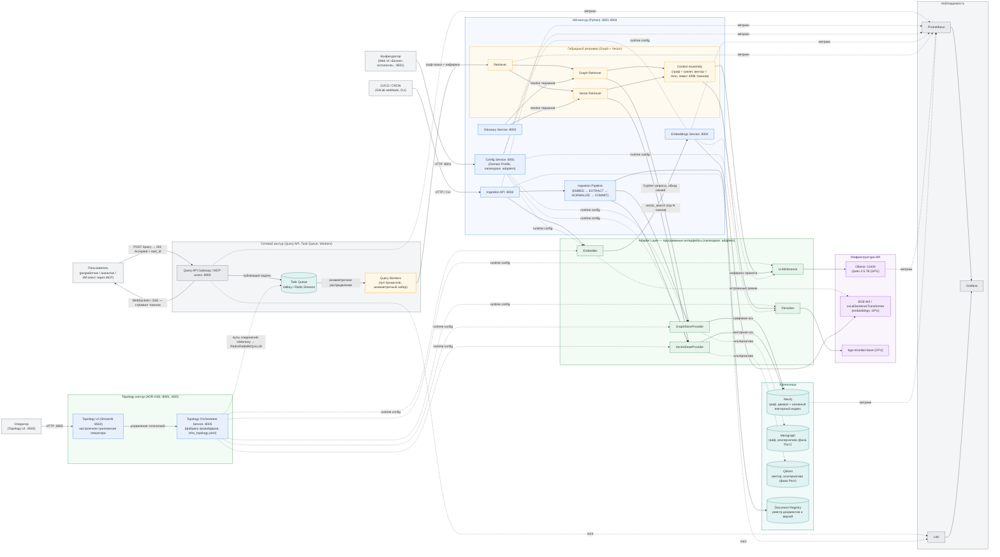
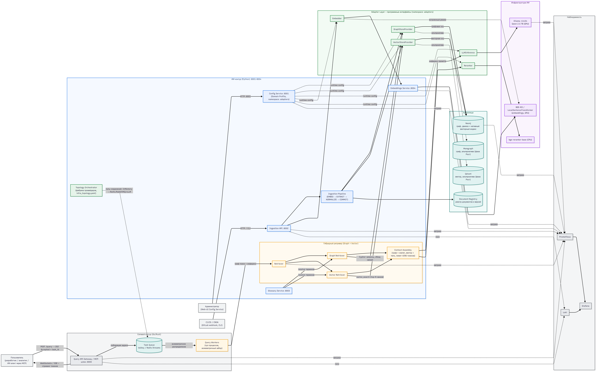

# GraphRAG: Высокоуровневая архитектура

> **Версия:** v6 (итерация поверх базы v5)
> **Последнее обновление:** 2026-09-05
> **Рендер:** схемы заданы как Mermaid-блоки — GitHub и совместимые превью рисуют их нативно. Экспорт в PNG/SVG при необходимости: [mermaid.live](https://mermaid.live) или `npx @mermaid-js/mermaid-cli -i diagram.mmd -o diagram.svg`. Актуальное изображение: [./assets/hi_level_architecture_v6.png](./assets/hi_level_architecture_v6.png).
> История: блоки-срезы v4 и отдельная схема v5 не поддерживаются; исторические копии — в `docs.zip` и `docs/history.md`. Детализация текущей итерации — в этом файле (Mermaid) и `docs/05_adr_log.md` (ADR-013).

## 1. Актуальная архитектура (итерация v6)

Одна цельная картина: база v5 (гибридный ретривер Graph + Vector, Adapter Layer, сервисы) слита с обновлением v6 (асинхронный Task Queue контур, Query Workers, Topology Orchestrator). На Этапе 8 Topology Orchestrator выделен в отдельный сервис с собственным настроечным UI (ADR-019): конфигуратор «Бизнес-онтология» (:8501) и Topology UI (:8502) — раздельные приложения.

*Легенда:* серый — актёры и сетевой контур (язык реализации — по ADR-020 для прототипа,
на усмотрение реализации; см. `docs/web_layer_replacement.md`); оранжевый — Query Workers;
бирюзовый — очередь и хранилища; синий — ИИ-контур (Python, включая Topology контур/UI
по ADR-019); фиолетовый — инфраструктура ИИ; жёлтый — гибридный ретривер.

---

## 2. Соответствие блоков SSOT

| Блок на схеме                     | Источник |
|-----------------------------------|----------|
| Базис v5 (гибридный ретривер, Adapter Layer, сервисы) | CONCEPT.md v5 (§2.1, §4, §5), `docs/05_adr_log.md` (ADR-012, ADR-013) |
| Асинхронный контур (Gateway, Task Queue, Workers) | CONCEPT.md v5 (база), `docs/history.md` (Этап 6), `docs/05_adr_log.md` (ADR-013), `docs/06_operations_and_risks.md` |
| Topology Orchestrator / `prototype/infra_topology.yaml` | `docs/history.md` (Этап 6), `docs/infrastructure_stack.md` §2, `docs/05_adr_log.md` (ADR-019 — отдельный сервис + Topology UI) |
| `GraphStoreProvider` / `VectorStoreProvider` | CONCEPT.md §2.1, `docs/adapters_specification.md` |
| Хранилища: Neo4j / Memgraph / Qdrant / Document Registry | CONCEPT.md §2.1, §6.5 `namespace: storage` |
| Наблюдаемость: Prometheus / Grafana / Loki | CONCEPT.md §8 Operations |

---

## 3. Как обновлять схему при изменении концепта

1. Правь только Mermaid-блоки — они рендерятся автоматически (git diff читаемый).
2. Держи названия блоков в синхроне с SSOT: имена интерфейсов (`GraphStoreProvider`, `VectorStoreProvider`) — из CONCEPT.md §2.1, порты — из `docs/04_services_config.md`, асинхронный контур — из `docs/05_adr_log.md` (ADR-013).
3. Новая итерация концепции замещает актуальную схему целиком; прежние срезы не поддерживаются и живут только в истории (`docs.zip`, `docs/history.md`).